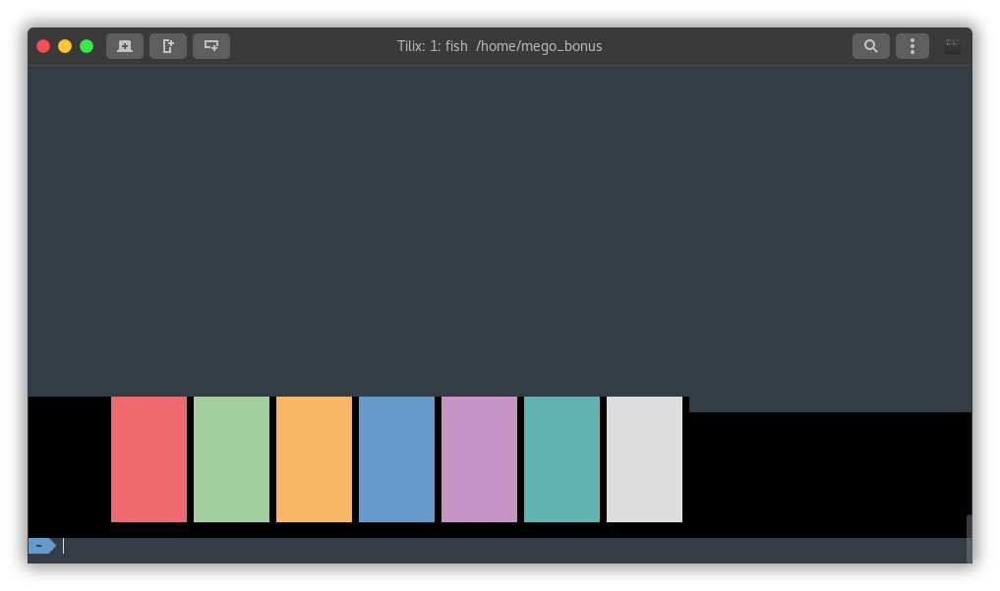

# Tilix Mariana color scheme

### How to use:
* You need to install Tilix from [Tilix Git](https://github.com/gnunn1/tilix) or [Tilix Website](https://gnunn1.github.io/tilix-web/) to use my theme.

* Copy tilix-mariana.json to
```
~/.config/tilix/schemes/
```
* OR 
```
./install.sh
```

### Uninstall:
* Just delete the theme *.json from config folder


### Screenshot:
 